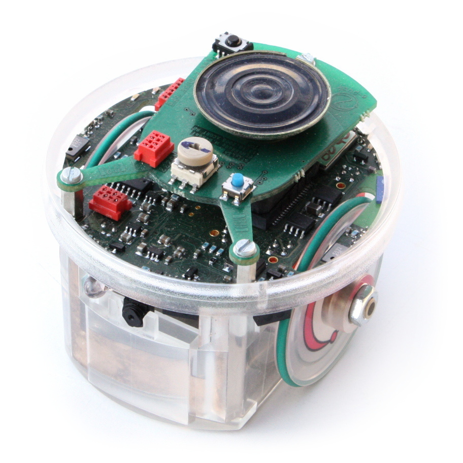

# MechBot
This is code for a maze navigating robot. The Processor on the Bot was a Atmega 328p, with 4 motor drive and infrared distance sensors. 

> The maze navigating robot was based on the E-Puck design. Not actual bot image. 

---

### Table of Contents

- [MechBot](#mechbot)
    - [Table of Contents](#table-of-contents)
  - [Description](#description)
      - [Technologies](#technologies)
  - [How To Use](#how-to-use)
      - [Installation](#installation)

---

## Description

This project utilizises the 2 front I.R distance sensors to know what is in front. The bot utilizes a wall-follower algorith to find its way out. 

The control system has a prefered direction and will turn whenever the front of the bot is blocked. 

The bot also follows a black line to find its way to the maze entrance. 

### Technologies

- arduino
- C/C++

[Back To The Top](#read-me-template)

---

## What I learnt
>- Code sharing amongst team members
>
>- Planin and researching code 
>
>- Importance of testing code

[Back To The Top](#maritime-life-support-device)

---

## How To Use

#### Installation
To load onto the arduino you can use the regular arduino IDE. for the system to work you require:

- Mechbot
- arduino

